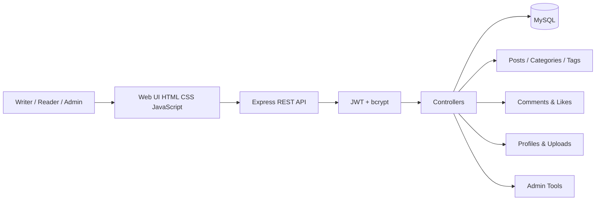
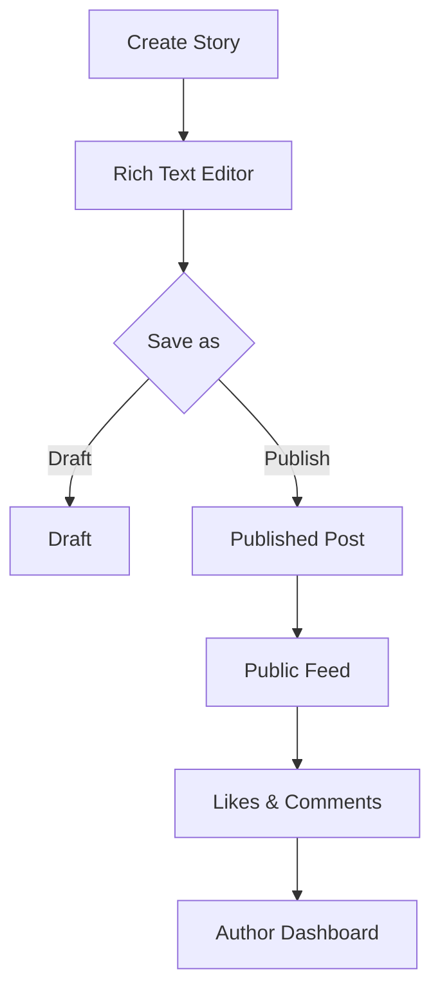
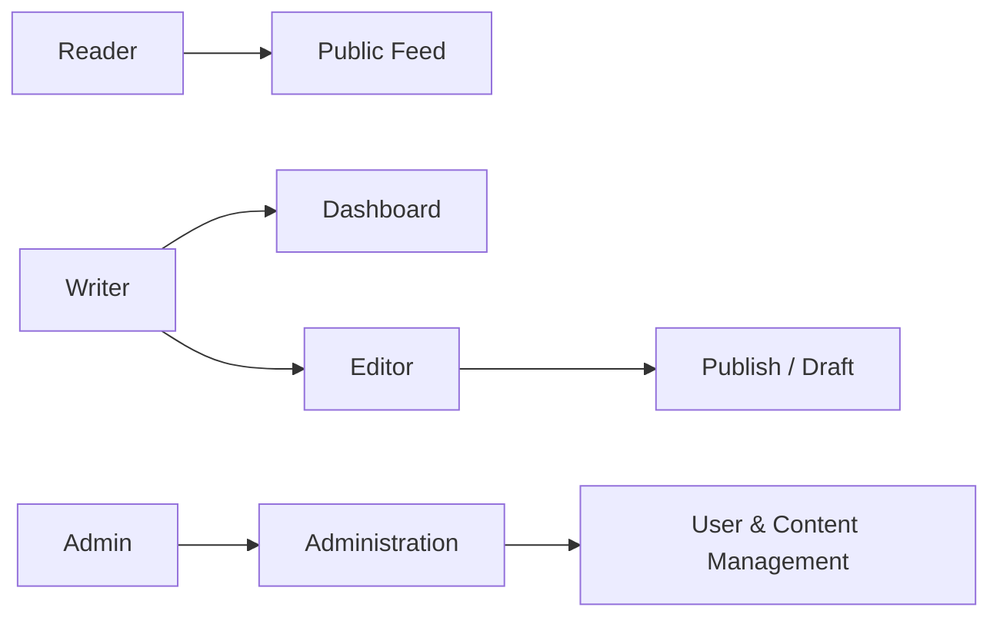

# Bloggie

Bloggie is a light, editorial-style multi-user blogging platform where writers can publish stories, build profiles, interact through comments and likes, and manage content from a personal dashboard.

## Highlights
- Multi-user registration and JWT authentication
- Author profiles and avatar uploads
- Rich-text writing and editing with Quill
- Draft and published workflows
- Categories, tags, search, and pagination
- Comments, moderation, and likes
- Personal author dashboard
- Admin statistics and user management
- MySQL relational data model
- HTML sanitization, parameterized SQL, Helmet, and rate limiting
- Responsive light editorial UI

## Architecture
```text
Bloggie/
├── backend/
│   ├── config/       # MySQL connection
│   ├── controllers/  # Application/business logic
│   ├── middleware/   # JWT auth, roles, uploads, errors
│   ├── routes/       # REST API endpoints
│   ├── utils/        # Token and validation helpers
│   └── server.js     # Express entry point
├── database/
│   └── schema.sql    # Relational schema
├── frontend/
│   ├── assets/
│   ├── css/
│   ├── js/
│   └── *.html
└── tests/
    └── health.test.js
```

### Request flow
```text
Browser → HTML/CSS/JS → Express REST API → JWT middleware/controllers → MySQL
```

## Tech Stack
Frontend: HTML, CSS, JavaScript, Quill  
Backend: Node.js, Express.js  
Database: MySQL  
Authentication: JWT + bcrypt  
Security: Helmet, rate limiting, sanitize-html, parameterized queries

## Local setup
1. Install Node.js and MySQL.
2. Open `backend`.
3. Run `npm install`.
4. Create `backend/.env` from `.env.example`.
5. Import `database/schema.sql`.
6. Run `npm start`.
7. Open `http://localhost:5001`.

Admin setup:
```sql
UPDATE users SET role='admin' WHERE email='your-email@example.com';
```


## System Architecture



## Publishing Workflow



## User Roles


